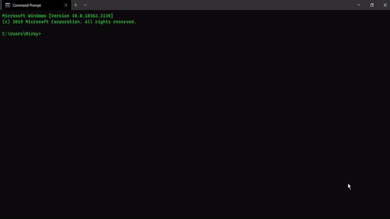

## Bangjago Android Emulator (CLI Version)

**Bangjago Emulator** adalah aplikasi cli sederhana yang digunakan untuk **Pegembangan Mobile Development**, yang dimana fungsinya itu sebagai **Android Emulator**, fungsinya kurang lebih sama seperti dengan **Genymotion** walaupun tidak sebagus seperti **Genymotion** dan saya menambahkan beberapa fiture yang tidak ada di **Genymotion**, seperti terhubung dengan **USB Debugging** dan **Wireless** menggunakan **Perangkat Seluler** anda untuk **Pegembangan Mobile Development**, untuk saat ini hanya tersedia untuk pengguna **Windows** saja, di lain waktu mungkin saya akan membuatnya untuk versi **Mac OS atau Linux**.

## Table Of Content

- [Get Started](#get-started)
  - [Features](#Features)
  - [Command](#Command)
  - [How To Use](#How-To-Use)
  - [Default Port Device](#Default-Port-Device)
  - [System Images List](#System-Images-List)
  - [Skin Device List](#Skin-Device-List)
  - [Translate](#Translate)
  - [Support Project](#Support-Project)
  - [Video Tutorial](#Video-Tutorial)
  - [Author](#Author)
  - [Contributor](#Contributor)
  - [License](#License)

### Features:

- [x] sangat mudah digunakan
- [x] daya penggunaan cpu dan ram yang rendah
- [x] terhubung melalui usb dan wireless
- [x] terhubung melalui android emulator
- [x] instalasi Android Studio dan Java JDK secara otomatis
- [x] support untuk React Native, Flutter, Ionic, Native Script etc

### Command:
- #### **ADB TOOLS**
  + **Add Adb USB** digunakan untuk menambahkan **port usb debugging**
  + **Add Adb Wireless** digunakan untuk menambahkan **ip address**
  + **Restart ADB** digunakan untuk mereset **adb** ke **default port**
  + **Check ADB** digunakan untuk megecek apakah **adb device** sudah **terhubung/belum**
  - **Running Emulator** digunakan untuk menjalakan **emulator** melalui **usb debugging** atau **wireless**

- #### **SDK TOOLS**
  + **Google Android SDK** untuk mendownload **android sdk** versi **android-google apis**
  + **Default Android SDK** untuk mendownload **android sdk** versi **android-default**
  + **TV Android SDK** untuk mendownload **android sdk** versi **android-tv**
  + **Wear Android SDK** untuk mendownload **android sdk** versi **android-wear**
  + **Google Playstore SDK** untuk mendownload **android sdk** versi **google_apis_playstore**

- #### **AVD TOOLS**
  + **List AVD Emulator** untuk menampilkan semua **avd emulator** yang tersedia
  + **Create AVD Emulator** untuk membuat **avd emulator baru**
  + **Running AVD Emulator** untuk menjalankan **avd emulator**
  + **Delete AVD Emulator** untuk menghapus **avd emulator**
  + **Update AVD Emulator** untuk memperbarui **avd emulator**

- #### **SOFTWARE TOOLS**
  + **Java JDK** untuk mendownload **java jdk** secara otomatis
  + **Android Studio** untuk mendownload **android studio** secara otomatis

- #### **More Information**
  + informasi terkait **developer** dan dukungan **donation project**

### How To Use:

- #### Menjalankan Aplikasi

  - install Android Studio dan java jdk terlebih dahulu jika belum terinstall di laptop/komputer anda melalui cli
  - install Java JDK versi jdk-8u261 [download disini](https://www.filehorse.com/download-java-development-kit-64/52937/) jika mengalami **error**
  - upgrade `Android Studio` anda ke `versi 4.1` jika mengalami error saat mendownload **Android SDK**
  - copy path **android sdk** ke **environment system variables -> ANDROID_HOME** seperti ini jika belum
  - copy path **java jdk** ke **environment system variables -> JAVA_HOME** seperti ini jika belum
  - download bangjago emulator melalui tautan link bit.ly diatas
  - kemudian extract bangjago emulator.zip ke **Localdisk C:**
  - properties **my computer -> advanced systems settings -> environment variables**
  - copy path C:\bangjago ke **environment systems variables -> path**
  - copy path C:\bangjago ke **environment systems variables -> bangjago**
  - kemudian buka **cmd** dan ketikan **start bangjago**, jangan menggunakan terminal selain **cmd**
  - jika anda ingin menginstall **Android Studio** atau **Java JDK** **run as** dibutuhkan

- #### Terhubung Melalui USB Debugging

  - sediakan kabel usb terlebih dahulu
  - nyalakan pengaturan **usb debugging** pada smartphone anda
  - pastikan smartphone anda sudah terhubung di **laptop/komputer**
  - pilih **adb tools** kemudian pilih **add adb usb**
  - masukan port default usb debugging sesuai **perangkat** tersebut
  - kemudian jalankan emulator pilih **running emulator -> emulator usb**
  - jika tidak terhubung pilih **adb tools -> restart adb** kemudian ulangi lagi dari awal

- #### Terhubung Melalui Wireless

  - sediakan kabel usb terlebih dahulu
  - kemudian masukan usb ke port **laptop/komputer** anda
  - nyalakan pengaturan **usb debugging** pada smartphone anda
  - pastikan smartphone anda sudah terhubung di **laptop/komputer**
  - pilih **adb tools** kemudian pilih **adb wireless**
  - masukan **ip address** default sesuai **perangkat** tersebut
  - ketika emulator berhasil ditampilkan, cabut smartphone anda dari usb
  - kemudian tutup emulator dan jalankan emulator kembali pilih **running emulator -> emulator wireless**
  - jika tidak terhubung pilih **adb tools -> restart adb** kemudian ulangi lagi dari awal
  - atau ikuti tutorial berikut ini **[React Native](https://tinyurl.com/y6rvxsln)** atau **[Flutter](https://tinyurl.com/yxwpy7w7)**

- #### Terhubung Melalui Emulator
  - pilih **avd tools -> create emulator** maka nanti **Android SDK** akan didownload secara otomatis
  - lewati cara **pertama** jika **avd emulator** sudah ada sebelumnya
  - kemudian jalankan emulator **pilih avd tools -> running emulator**
  - kemudian masukan **nama emulator** yang sudah pernah dibuat sebelumnya
  - android emulator berhasil dijalankan

### Default Port Device:

| Name         | IP Address/Port | Type     |
| ------------ | --------------- | -------- |
| Local        | 5555            | USB      |
| React Native | 8081            | USB      |
| Flutter      | 8080            | USB      |
| Local        | 192.168.x.x     | Wireless |
| React Native | 192.168.x.x     | Wireless |
| Flutter      | 192.168.x.x     | Wireless |

### System Images List:

- #### Google System Images

  | Android API Version | Target Version | CPU Version |
  | ------------------- | -------------- | ----------- |
  | Android 16          | google_apis    | x86         |
  | Android 16          | google_apis    | armeabi-v7a |
  | Android 17          | google_apis    | x86         |
  | Android 17          | google_apis    | armeabi-v7a |
  | Android 18          | google_apis    | x86         |
  | Android 18          | google_apis    | armeabi-v7a |
  | Android 19          | google_apis    | x86         |
  | Android 19          | google_apis    | armeabi-v7a |
  | Android 21          | google_apis    | x86         |
  | Android 21          | google_apis    | x86_64      |
  | Android 21          | google_apis    | armeabi-v7a |
  | Android 22          | google_apis    | x86         |
  | Android 22          | google_apis    | x86_64      |
  | Android 22          | google_apis    | armeabi-v7a |
  | Android 23          | google_apis    | x86         |
  | Android 23          | google_apis    | x86_64      |
  | Android 23          | google_apis    | armeabi-v7a |
  | Android 24          | google_apis    | x86         |
  | Android 24          | google_apis    | x86_64      |
  | Android 24          | google_apis    | arm64-v8a   |
  | Android 25          | google_apis    | x86         |
  | Android 25          | google_apis    | x86_64      |
  | Android 25          | google_apis    | armeabi-v7a |
  | Android 25          | google_apis    | arm64-v8a   |
  | Android 26          | google_apis    | x86         |
  | Android 26          | google_apis    | x86_64      |
  | Android 27          | google_apis    | x86         |
  | Android 28          | google_apis    | x86_64      |
  | Android 29          | google_apis    | x86         |
  | Android 29          | google_apis    | x86_64      |
  | Android 30          | google_apis    | x86         |
  | Android 30          | google_apis    | x86_64      |

- #### Default System Images

  | Android API Version | Target Version | CPU Version |
  | ------------------- | -------------- | ----------- |
  | Android 16          | default        | x86         |
  | Android 16          | default        | armeabi-v7a |
  | Android 17          | default        | x86         |
  | Android 17          | default        | armeabi-v7a |
  | Android 18          | default        | x86         |
  | Android 18          | default        | armeabi-v7a |
  | Android 19          | default        | x86         |
  | Android 19          | default        | armeabi-v7a |
  | Android 21          | default        | x86         |
  | Android 21          | default        | x86_64      |
  | Android 21          | default        | armeabi-v7a |
  | Android 22          | default        | x86         |
  | Android 22          | default        | x86_64      |
  | Android 22          | default        | armeabi-v7a |
  | Android 23          | default        | x86         |
  | Android 23          | default        | x86_64      |
  | Android 23          | default        | armeabi-v7a |
  | Android 24          | default        | x86         |
  | Android 24          | default        | x86_64      |
  | Android 24          | default        | armeabi-v7a |
  | Android 25          | default        | x86         |
  | Android 25          | default        | x86_64      |
  | Android 26          | default        | x86         |
  | Android 26          | default        | x86_64      |
  | Android 27          | default        | x86         |
  | Android 27          | default        | x86_64      |
  | Android 28          | default        | x86         |
  | Android 28          | default        | x86_64      |
  | Android 30          | default        | x86         |
  | Android 30          | default        | x86_64      |

- #### TV System Images

  | Android API Version | Target Version | CPU Version |
  | ------------------- | -------------- | ----------- |
  | Android 21          | android-tv     | x86         |
  | Android 21          | android-tv     | armeabi-v7a |
  | Android 22          | android-tv     | x86         |
  | Android 23          | android-tv     | x86         |
  | Android 23          | android-tv     | armeabi-v7a |
  | Android 24          | android-tv     | x86         |
  | Android 25          | android-tv     | x86         |
  | Android 26          | android-tv     | x86         |
  | Android 27          | android-tv     | x86         |
  | Android 28          | android-tv     | x86         |
  | Android 29          | android-tv     | x86         |

- #### Wear OS System Images

  | Android API Version | Target Version | CPU Version |
  | ------------------- | -------------- | ----------- |
  | Android 23          | android-wear   | x86         |
  | Android 23          | android-wear   | armeabi-v7a |
  | Android 25          | android-wear   | x86         |
  | Android 25          | android-wear   | armeabi-v7a |
  | Android 26          | android-wear   | x86         |
  | Android 28          | android-wear   | x86         |

- #### Google Playstore System Images

  | Android API Version | Target Version        | CPU Version |
  | ------------------- | --------------------- | ----------- |
  | Android 24          | google_apis_playstore | x86         |
  | Android 25          | google_apis_playstore | x86         |
  | Android 26          | google_apis_playstore | x86         |
  | Android 27          | google_apis_playstore | x86         |
  | Android 28          | google_apis_playstore | x86         |
  | Android 28          | google_apis_playstore | x86_64      |
  | Android 29          | google_apis_playstore | x86         |
  | Android 29          | google_apis_playstore | x86_64      |
  | Android 30          | google_apis_playstore | x86         |
  | Android 30          | google_apis_playstore | x86_64      |

### Skin Device List:

- #### Default Phone Device

  | Name                   | Ram     | CPU Cores | Internal Storage |
  | ---------------------- | ------- | --------- | ---------------- |
  | 2.7_QVGA               | 1024 MB | 1 Core    | 2048 MB          |
  | 2.7_QVGA_slider        | 1024 MB | 1 Core    | 2048 MB          |
  | 3.2_QVGA_ADP2          | 1024 Mb | 1 Core    | 2048 MB          |
  | 3.3_WQVGA              | 1024 Mb | 1 Core    | 2048 MB          |
  | 3.4_WQVGA              | 1024 Mb | 1 Core    | 2048 MB          |
  | 3.7_FWVGA_slider       | 1024 Mb | 1 Core    | 2048 MB          |
  | 3.7_WVGA_Nexus_One     | 1024 Mb | 1 Core    | 2048 MB          |
  | 4.7_WXGA               | 1024 Mb | 1 Core    | 2048 MB          |
  | 4.65_720p_Galaxy_Nexus | 1024 Mb | 1 Core    | 2048 MB          |
  | 4_WVGA_Nexus_S         | 1024 Mb | 1 Core    | 2048 MB          |
  | 5.1_WVGA               | 1024 Mb | 1 Core    | 2048 MB          |
  | 5.1_WVGA_API           | 1024 Mb | 1 Core    | 2048 MB          |
  | 5.4_FWVGA              | 1024 Mb | 1 Core    | 2048 MB          |
  | 7.3_Foldable           | 2048 MB | 1 Core    | 4096 MB          |
  | 8_Foldable             | 2048 MB | 1 Core    | 4096 MB          |
  | Galaxy_Nexus           | 1024 MB | 1 Core    | 2048 MB          |
  | Nexus_4                | 2048 MB | 1 Core    | 4096 MB          |
  | Nexus_5                | 2048 MB | 1 Core    | 4096 MB          |
  | Nexus_5X               | 2048 MB | 1 Core    | 4096 MB          |
  | Nexus_6                | 2048 MB | 1 Core    | 4096 MB          |
  | Nexus_6P               | 2048 MB | 1 Core    | 4096 MB          |
  | Nexus_One              | 1024 MB | 1 Core    | 2048 MB          |
  | Nexus_S                | 1024 MB | 1 Core    | 2048 MB          |
  | Pixel                  | 2048 MB | 1 Core    | 4096 MB          |
  | Pixel_2                | 2048 MB | 1 Core    | 4096 MB          |
  | Pixel_2_XL             | 2048 MB | 1 Core    | 4096 MB          |
  | Pixel_3                | 2048 MB | 1 Core    | 4096 MB          |
  | Pixel_3_XL             | 2048 MB | 1 Core    | 4096 MB          |
  | Pixel_3a               | 2048 MB | 1 Core    | 4096 MB          |
  | Pixel_3a_XL            | 2048 MB | 1 Core    | 4096 MB          |
  | Pixel_XL               | 2048 MB | 1 Core    | 4096 MB          |

  - #### Default Tablet Device

  | Name             | Ram     | CPU Cores | Internal Storage |
  | ---------------- | ------- | --------- | ---------------- |
  | 7_WSVGA_Tablet   | 1024 MB | 1 Core    | 2048 MB          |
  | 10.1_WXGA_Tablet | 1024 MB | 1 Core    | 2048 MB          |
  | Nexus_7          | 2048 Mb | 1 Core    | 4096 MB          |
  | Nexus_7_2012     | 1024 Mb | 1 Core    | 2048 MB          |
  | Nexus_9          | 2048 Mb | 1 Core    | 4096 MB          |
  | Nexus_10         | 2048 Mb | 1 Core    | 4096 MB          |
  | Pixel_C          | 2048 Mb | 1 Core    | 4096 MB          |

  - #### Default TV Device

  | Name                    | Ram     | CPU Cores | Internal Storage |
  | ----------------------- | ------- | --------- | ---------------- |
  | Android_Wear_Round      | 1024 MB | 1 Core    | 2048 MB          |
  | Android_Wear_Round_Chin | 1024 MB | 1 Core    | 2048 MB          |
  | Android_Wear_Square     | 1024 MB | 1 Core    | 2048 MB          |

### Translate:

- [Indonesian](https://github.com/restuwahyu13/bangjago-android-emulator/blob/main/README_IND.md)
- [English](https://github.com/restuwahyu13/bangjago-android-emulator/blob/main/README.md)

### Support Project:

Jika anda suka dengan **project ini** atau anda ingin **mensupport project ini**, anda bisa **mentraktir saya secangkir kopi** atau bisa **berdonasi** melalu link berikut ini **[Donate](https://bit.ly/37KsgkB)**.

### Video Tutorial:

- [Tutorial](https://bit.ly/2G5KUYR)

### Author:

- [Restu Wahyu Saputra](https://github.com/restuwahyu13)

### Contributor:

- [Vicri Kurniawan](https://github.com/vicrfiport)

### License:

- [MIT](https://github.com/restuwahyu13/bangjago-emulator/blob/main/LICENSE.MD)

  <b><a href="#Bangjago-Android-Emulator-(CLI Version)">BACK TO TOP</a></b>

